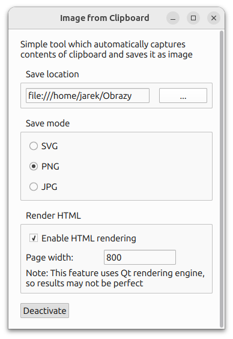

Simple tool which can create images from clipboard contents
and save it as file to specific directory automatically.

HTML rendering is also supported. If user copies HTML into clipboard,
the application will render the image into a document of specified
width. Rendering is done using QTextDocument engine, so results may not
be perfect.

### Attributions

App icon:

<a href="https://www.flaticon.com/free-icons/screenshot" title="screenshot icons">Screenshot icons created by icon_small - Flaticon</a>
